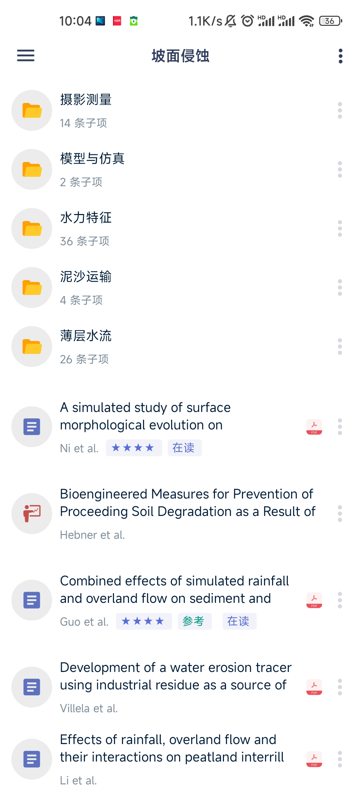
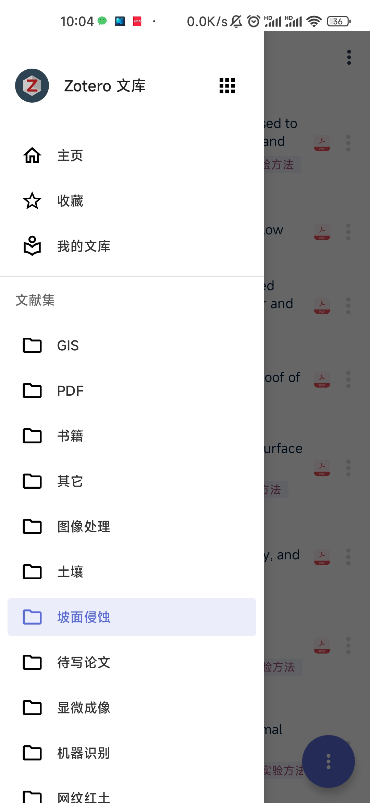
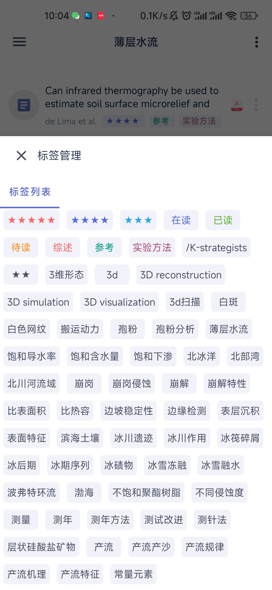
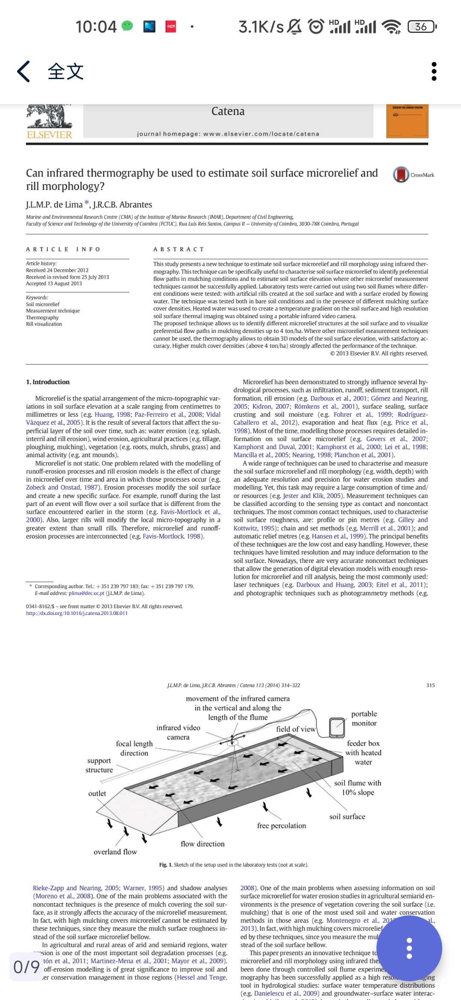

# ZoteroX

ZoteroX is a third-party zotero client. This project is based on zoo-for-zotero.

## What's new

  - Redesign app UI
  - Add in-app pdf viewer
  - Fix some bugs concerning WebDAV

## Screenshots

There are some screenshot of ZoteroX.

      

      

## Features

  - Support for organization via Collections, including subcollections
  - Supports two way syncing of attachments for (including WebDav)
  - Support for viewing group libraries
  - Supports the creating, editing and deleting Zotero's notes
  - Flexible searching of your library
  - Written in Kotlin using the MVP design pattern for a fast native experience
  - Currently readonly, but have plans allow for editing in the future
  - Support for the Zotero Account Sync service

## Libraries utilised

  - Dagger2
  - RxJava2
  - Room
  - Retrofit
  - okhttp3
  - android-pdf-viewer
  - pdfium-android
  - And more, the full list can be found in the app.gradle.

## How to Contribute

Any contributions, whether it be pull requests or even suggestions are welcome!
I am kind of busy but I will get to it!

## License

 * The application is released fully under GPLv3
 * This application is 100% Free with no ads!
 * We utilise graphical resources directly from the desktop zotero client.

This is a third party zotero client and is not affiliated with Zotero.
